% Geometric \& Graphics Programming Lab: Lecture 11
% Alberto Paoluzzi
% \today

\tableofcontents

# Workshop N.3 

## Leonardo's centralized church schemes 


 


##  Theme definition

*	using some pyplasm primitives (**`SPHERE, CYLINDER, PROD, QUOTE, CUBOID`**, etc),

*	generate a *3D model* of Leonardo's **centralized church** scheme

*	complete **choice freedom** for the *topic*, the *tools*, and the *style of coding*


##  Look at some Leonardo's church schemes (1/8)

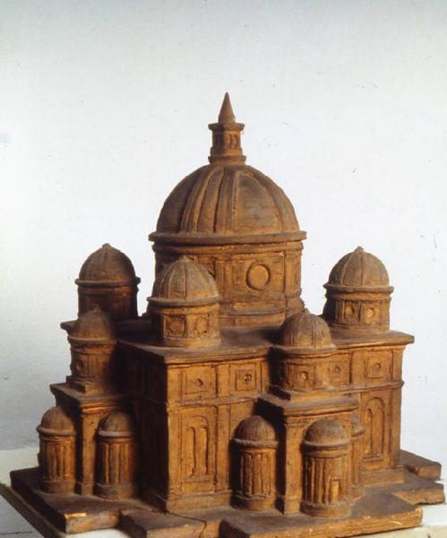
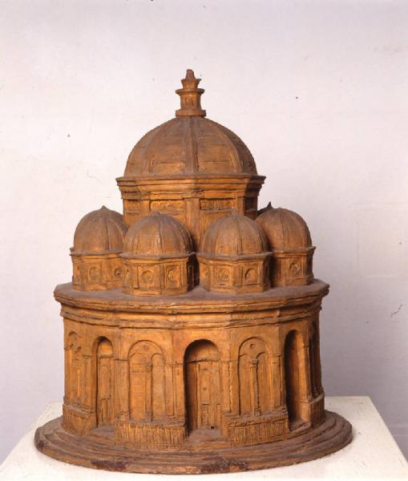

##  Look at some Leonardo's church schemes (2/8)

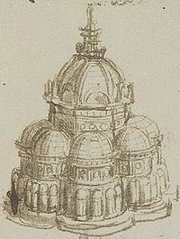
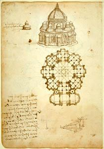

##  Look at some Leonardo's church schemes (3/8)

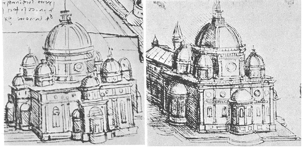
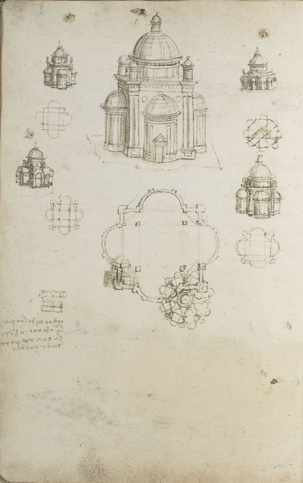

##  Look at some Leonardo's church schemes (4/8)

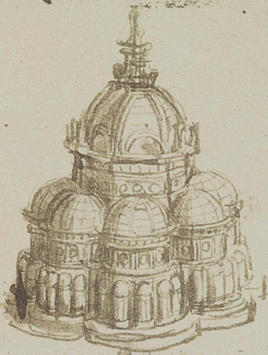
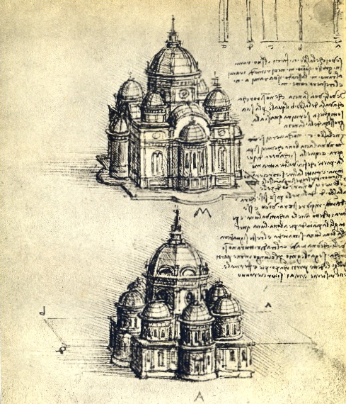

##  Look at some Leonardo's church schemes (5/8)

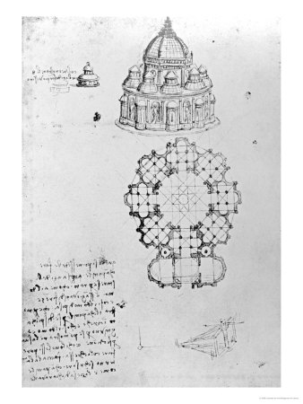
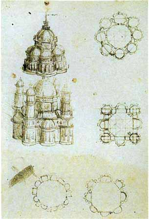

##  Look at some Leonardo's church schemes (6/8)

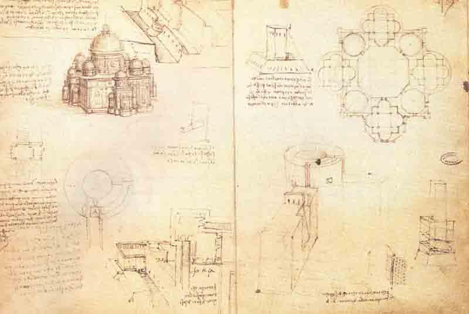
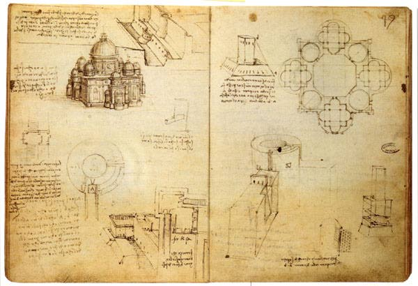

##  Look at some Leonardo's church schemes (7/8)

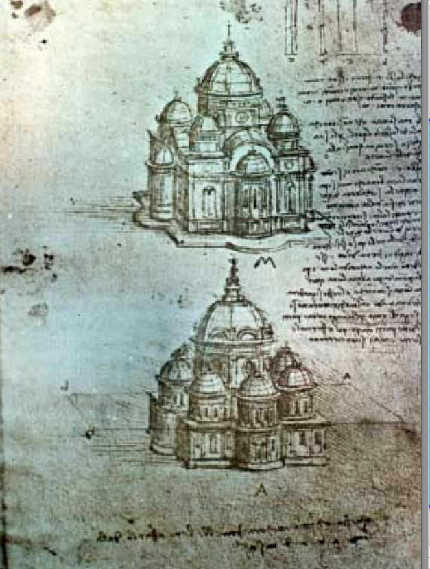
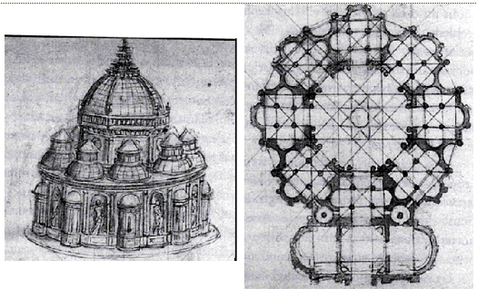

##  Look at some Leonardo's church schemes (8/8)

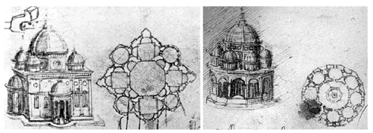
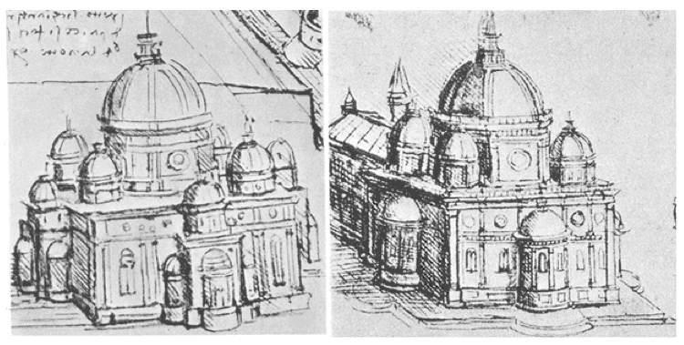


## Requirements

*	Write a single notebook,  named *`workshop_03.ipynb`* 

*	Choose a notebook Title,  for example **`<Leonardo_scheme>`** 

*	Start the notebook with a *web reference* and one/more *image/s* of your **scheme** 

*	List the **variables** used in your code, with a *textual definition*

*	Provide a *short description* of used **geometric methods** you are going to implement

*	Include the coding of a single parametric function named **`ggpl_<my_leonardo>`**

*	Provide the **images** generated by **some**  *executions* with different actual parameters.

* 	Use measures in *meters ($m$)*


## Style specs 


*	use **meaningfull** _identificators_ (variables and parameters)

*	use _camelCase_ ids

*	add **Python _`docstrings`_** (google for it)

*	produce a **single** notebook file, named *workshop_03.ipynb*

*	file path:  _`your_repo/2017-11-06/workshop_03.ipynb`_


# Minimal git/github instructions


## Minimal git/github instructions  (1/2)

create your local repository

```
$ mkdir 2017-11-06
$ cd 2017-11-06
$ touch workshop_03.ipynb
```


## Minimal git/github instructions  (2/2)

commit your work

```
$ git add -A .
$ git commit -m "add a short note to commit (Leonardo model?)"
$ git push origin master
```

